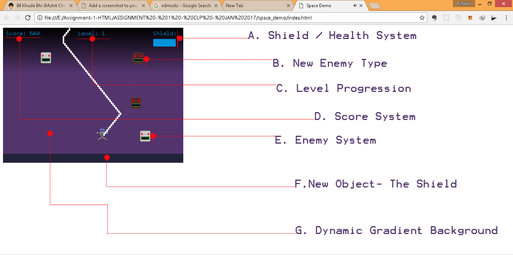
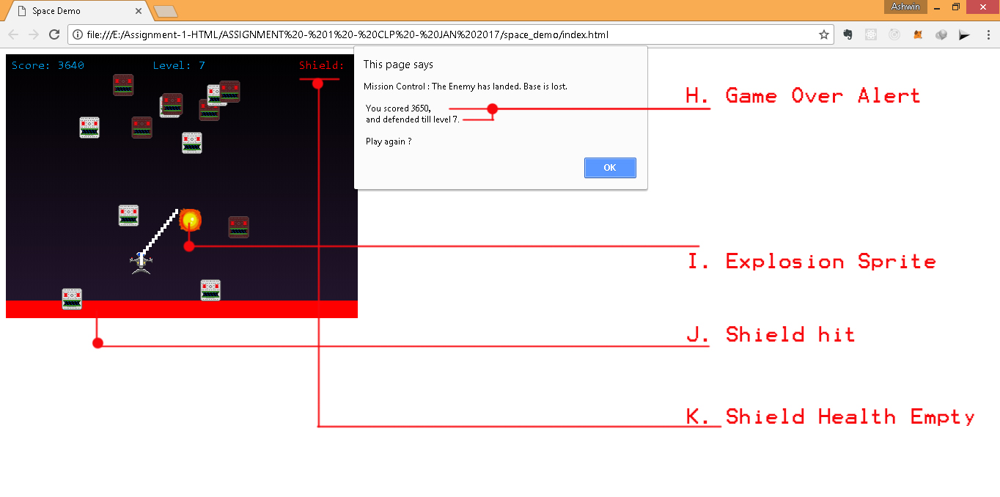

## Space invaders xtream

This game follows the tutorial given by Nagarro Campus . Except for some small changes to improve readability.
Extra features added are given below.

#### Features added - 1 

###### A. Shield / Health System

Instead of showing health with the help of numbers this game uses pictorial description of shield. Still the shield is shown empty after three enemy pass the ship and hit the new object shield below the ship. In the next hit game over screen is shown. 
Note. if player is hit by enemy its instant game over.

functions - 
`function draw_shield()` //handles the creation of shield and if its low then turns into red color

`for (var enemy in enemies) {`
`        if(collides(enemies[enemy],shield)) {`
`            shieldHealth --;` //handles reducing shield health when hit` 

###### B. New Enemy type

The new enemy type is created by photoshopping the normal enemy sprite and modifying the `enemy` object. A new attribute weight is introduced in `enemy` object which randomly assigns weight as either 10 or 20.  `I.weight = 10 + (Math.floor(Math.random() * 2) )* 10;` and then this weight is used to modify the sprite that appears in game by simple if else.
`if(I.weight == 10)`
`        I.sprite = Sprite("enemy");`
`    else`
`        I.sprite = Sprite("enemyMod");`

The new enemy instead of following a zig zag pattern comes right down and are difficult to deal with.

###### C. Level Progression & D. Score system

Score is updated whenever enemy explodes and `enemy.explode` function is called by updating a global variable `score`.
`score += I.weight;` 
The score is displayed by `function draw_score()`
This scoring function is then used to increase the level after every 500 points.
`function draw_level(){`
`    ctx.font = "16px monospace";`
`    ctx.fillStyle = "#0095DD";`
`    level = (score - (score%500))/500;`
`    ctx.fillText("Level: " + level, CANVAS_WIDTH/2-40, 20 )`
`}`

###### E. Enemy System

Apart from the introduction of new enemy following changes have been made-

1. Now the enemy creation function has been modified 
` if(Math.random() < 0.02 + 0.05 * level){`
`        enemies.push(Enemy());`  
   
so as the level increase more enemies are created. 

2. Enemy also are faster as level increases.
`I.yVelocity = 2 + level;`

###### F. New object shield 

A new object shield is created.
`var shield = {`
`    ...`
`    draw: function(){` 
`        ...`
`    } ,`
`    explode: function(){`
`        ...`
`        this.color = "red"`
`        setTimeout(()=>{`
`            this.color = "#222239"}, 500`
`        );`
`    }`
`}`

When shield comes to contact with enemy, it reduces the shield health. So `collisiondetection()` is applied for this too.

###### G. Dynamic Gradient Background

The background of the game changes as we progress in the level. 
`var grd=ctx.createLinearGradient(0,0,0,1 + 120 * level);`

So as difficulty increases aptly screen also goes darker.

#### Features added - 2

###### H. Game over alert

The screen displays a game over alert box after the game over.
THis alert box displays the score and the level.

###### I. Explosion sprite

whenever the the player is hit, the sprite is dynamically changed to explosion.
`I.explode = function() {`
`        ...`
`        Sound.play("explosion");`
`        this.sprite = Sprite("explosion");`
`        setTimeout (()=>{this.active = false},100);`

setTimeout is used so that the player explosion sprite is shown for atleast 100ms. 

for enemy explosion this game uses 'canvas.drawimage' function.
`var img = new Image();`
`img.src = "images/explosion.png";`
`img.addEventListener("load", function drawPic(x, y){ctx.drawImage(img, x, y)}, false);`

###### J. When shield is hit it turns red and after 3 hits another hit is game over.
###### K. The shield also turns red and progressively empty as more enemy hit it.

#### Bugs

1. Multiple hits by bullets even after first hit.
2. Enemy collision with the base increases score.
